 

I do vulnerability assessments and penetration testing. I like learning from people
better than me, and I spend an unreasonable amount of time on philosophy, which
turns out to be good training for finding the assumptions a system quietly makes.

When I'm not doing that: games, anime, coffee, and not enough sleep.

 

[Writing](https://blankshiro.xyz) &nbsp;·&nbsp; [LinkedIn](https://linkedin.com/in/blankshiro)

 
